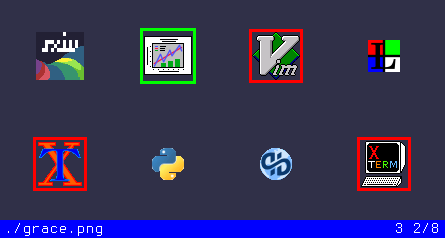

# Fork of **Simple X Image Viewer**

Changes
-------

* If a single image argument is given, the image is displayed as
expected, but all **other images in the directory are also loaded** for 
navigation [(#352)](https://github.com/muennich/sxiv/issues/352).

    * If more than one argument is given, then only the specified files
    and directories are loaded, as in mainstream Sxiv.

* No file will ever be loaded twice.

* Additional X-resources:

    * **Marks** are more conspicuous, a red rectangle around the image.
    [Thanks to @spaeps](https://github.com/muennich/sxiv/issues/294).

    * **Status bar colors**. 
    [Thanks to @jakem72360](https://github.com/muennich/sxiv/pull/386).

    * The directory of the first command-line argument was included in
    **window title**, which is now `[titlePrefix][Directory's basename]`,
    where `titlePrefix` defaults to "sxiv - ".

    * The full-screen background can be different.

* Escape key can be mapped in `config.h`.

Install
-------

    $ make
    # make install
